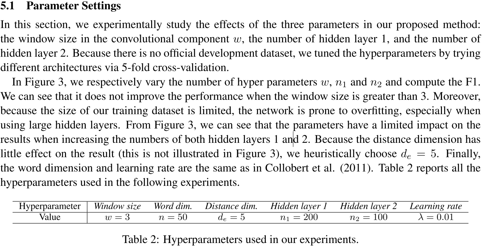
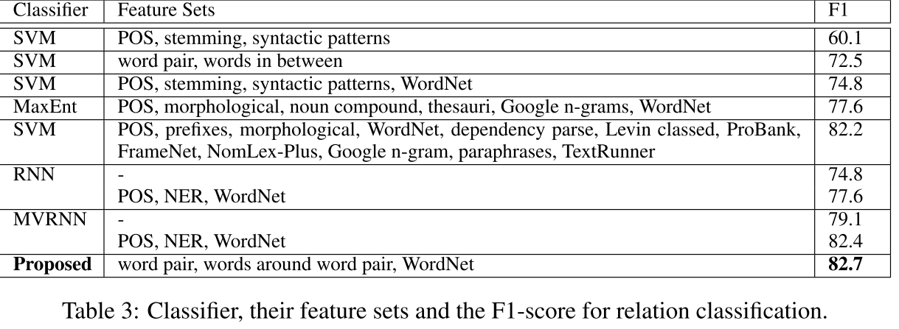
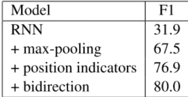
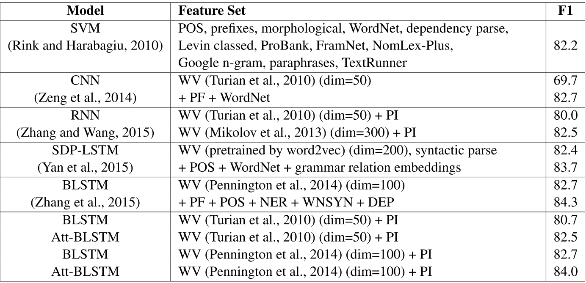
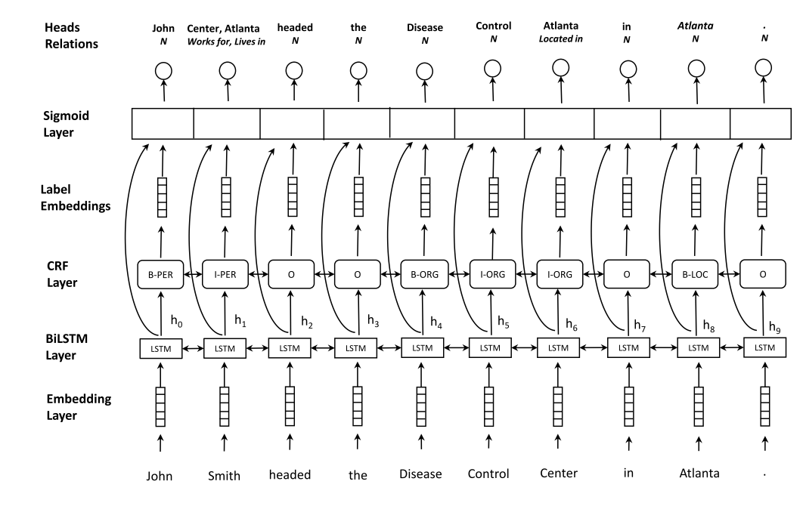
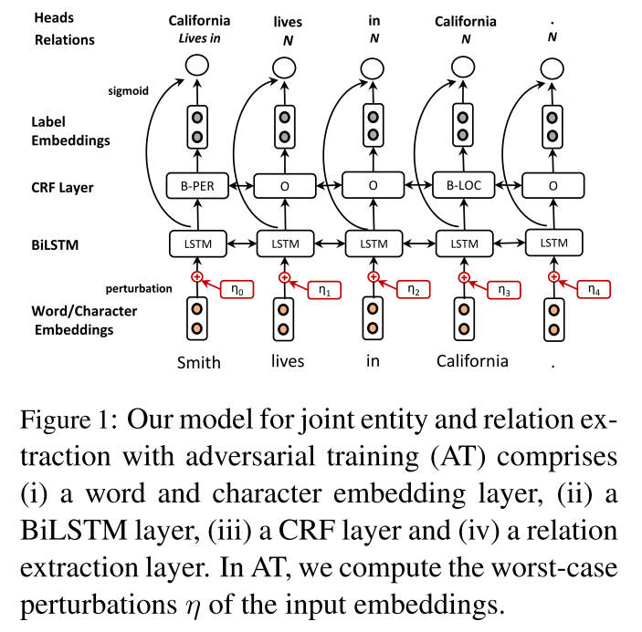
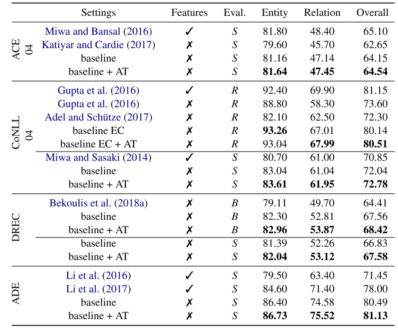
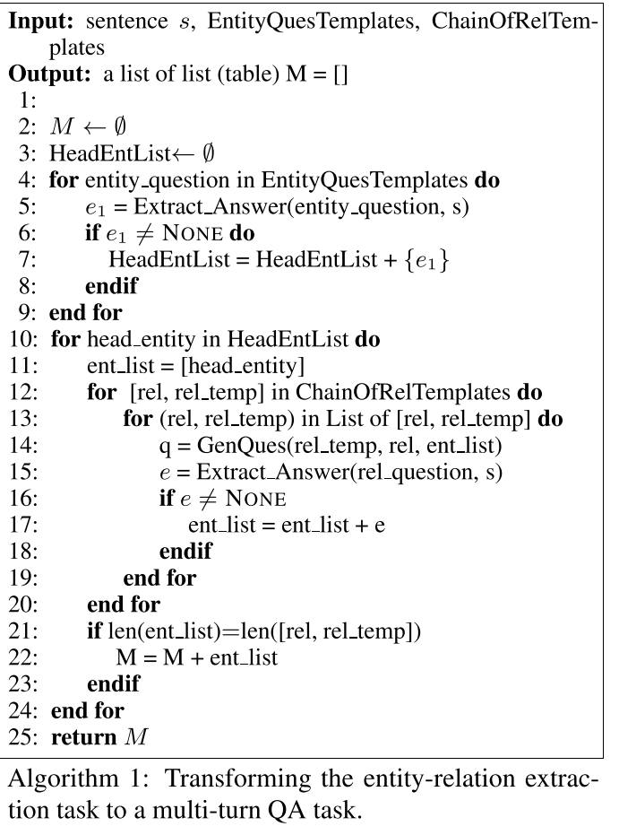

# 文献整理

>信息抽取的定义为：从自然语言文本中抽取指定类型的实体、关系、事件等事实信息，并形成结构化数据输出的文本处理技术。信息抽取是从文本数据中抽取特定信息的一种技术。文本数据是由一些具体的单位构成的，例如句子、段落、篇章，文本信息正是由一些小的具体的单位构成的，例如字、词、词组、句子、段落或是这些具体的单位的组合。抽取文本数据中的名词短语、人名、地名等都是文本信息抽取，当然，文本信息抽取技术所抽取的信息可以是各种类型的信息。

## Relation Classification via Convolutional Deep Neural Network

### 方法

>In this paper, we exploit a convolutional deep neural network(DNN) to extract lexical and sentence level features. Our method takes all of the word tokens as input without complicated pre-processing. First, the word tokens are transformed to vectors by looking up word embeddings1. Then, lexical level features are extracted according to the given nouns. Meanwhile, sentence level features are learned using a convolutional approach. These two level features are concatenated to form the final extracted feature vector. Finally, the features are fed into a softmax classifier to predict the relationship between two marked nouns. [@CNN-RELEATION]

利用卷积深度神经网络（DNN）来提取**词汇**和**句子级别**的特征。

- 预训练好的wordembedding
- senstence level提取特征

连接这两个级别的特征以形成最终提取的特征向量。最后，将这些特征输入softmax分类器以预测两个标记名词之间的关系。具体如下

- Word Representation

使用预训练好的word embedding作为Word Representation。

- Lexical Level Features

使用通用词嵌入作为基本特征的来源。选择标记名词的嵌入和上下文标记。所有这些功能都连接到词汇级别特征向量。从五个词法层面对句子进行特征提取，来使得我们的模型更加的有偏重性。

- Sentence Level Features

词嵌入技术已经能很好的表达词语之间的相关性。但是不能很好的捕捉远距离的词汇之间的关系，不能让计算机对于一个很长的句子表达有正确的理解。因此我们在句子级别的特征提取中使用卷积神经网络，希望能够结合所有的局部特征、提取句子中远距离的语法信息，最后生成我们的句子级别的特征向量。

本文将输入CNN的token进一步细分为Word Features (WF)和 Position Features
(PF)，其中WF通过设置窗口来在原始单词组成的捕捉句子中某一词语局部的上下文信息，实验决定3是最优窗口大小。

本文还引入了PF，这个是句子中的词语和目标词之间的左右相对距离：

- CNN

前面提取到的都是局部特征，通过CNN提取更加长更加全面的特征。这里的CNN只是简单的**两个隐层**的CNN，使用tanh作为非线性变换函数。

- softmax分类

将CNN输出的全局特征与sentence级别的局部词语表示结合作为输入：f=[l,g]，输出的是一个向量，指明每个分类的概率大小。

### 参数

### 结果

评价指标:F1

### 总结

- 使用词法和句子两大类特征，然后将两大类特征拼接到一起，最后接全连接层+softmax得到分类结果。

- 嵌入层使用了预训练的词向量，而不是随机初始化，不过用的不是word2vec，而是(Turian 2010 Word representations: a simple and general method for semi-supervised learning)提供的词嵌入。

- 加入了Position Feature，因为CNN更多强调的是局部信息，而Position Feature强调了实体信息。

> We conduct experiments using the SemEval-2010 Task 8 dataset.[@CNN-RELEATION]

使用SemEval 2010 Task 8 Dataset的数据集，考虑方向共19种关系

数据&代码见:https://github.com/FrankWork/conv_relation

或者这个：https://blog.csdn.net/herosunly/article/details/90145218

## Attention-Based Bidirectional Long Short-Term Memory Networks for Relation Classification

### 方法
>To tackle these problems,we propose Attention-Based Bidirectional Long Short-Term Memory Networks(Att-BLSTM) to capture the most important se-mantic information in a sentence. The experimental results on the SemEval-2010 relation classification task show that our method outperforms most of the existing methods, with only word vectors。[@zhou-etal-2016-attention]

引入了attention+BiLSTM的结构进行关系分类任务，数据基于SemEval-2010

###  Position Indicators

Position Indicators直接使用标签来表示两个entity的位置，例如在SemEval2010_task中:

The <e1> child </e1> was carefully wrapped and bound into the <e2> cradle </e2> by means of a cord
这个句子，就可以使用 <e1>、<\e1>、<e2>、<\e2>作为四个Indicators。在训练的时候，直接将这四个标签作为普通的word即可突出两个entity。这个方法也不是该论文首创的，在《Relation classification via recurrent neural network》，已经被提到，其效果如下图所示：

### 实验结果

代码：https://github.com/SeoSangwoo/Attention-Based-BiLSTM-relation-extraction

### 总结

>we propose a new paradigm for the task of entity-relation extraction. We cast the task as a multi-turn question answering problem, i.e., the extraction of entities and relations is transformed to the task of identifying answer spans from the context. This multi-turn
QA formalization comes with several key advantages: firstly, the question query encodes important information for the entity/relation class we want to identify; secondly, QA provides a natural way of jointly modeling entity and relation; and thirdly, it allows us to exploit the well developed machine reading comprehension (MRC) models.
Experiments on the ACE and the CoNLL04 corpora demonstrate that the proposed paradigm significantly outperforms previous best models. We are able to obtain the state-of-the-art results on all of the ACE04, ACE05 and CoNLL04 datasets, increasing the SOTA results on the three datasets to 49.4 (+1.0),60.2 (+0.6) and 68.9 (+1.1), respectively.

实体和关系的抽取转化为从上下文中识别答案跨度的任务。这种多回合的QA形式化有几个关键的优点：首先，问题查询(query)为想要识别的实体/关系类编码重要信息；其次，QA提供了一种自然的实体和关系联合建模的方式；第三，它能够开发出发展良好的机器阅读理解（MRC）模型。

在ACE和CoNLL04语料库上的实验表明，本文所提出的模型明显优于以前的最佳模型。我们能够获得所有ACE04、ACE05和CoNLL04数据集的最新结果，将这三个数据集的SOTA结果分别增加到49.4（+1.0）、60.2（+0.6）和68.9（+2.1）。

以往的模型主要分为两大类：
- 一类是流水线方法，先用标记模型识别实体，然后用关系抽取模型识别每个实体对之间的关系；pipline
- 另一类是联合方法，通过不同的策略将实体模型和关系模型结合起来，例如约束或参数共享。

## Joint entity recognition and relation extraction as a multi-head selection problem

实体关系联合抽取模型

>Specifically, we model the entity recognition task using a CRF (Conditional Random Fields) layer and the relation extraction task as a multi-head selection problem (i.e., potentially identify multiple relations for each entity).

使用CRF(条件随机域)层将实体识别任务和关系提取任务建模为一个多头选择问题。，可能为每个实体标识多个关系)

所谓多头，意思是任何特定的实体都可能涉及到与其他实体的**多种关系**

### 实体识别模型

模型的基本层如下图1所示:

(i)embedding层，
(ii)双向序列LSTM (BiLSTM)层，
(iii) CRF层，
(iv) sigmoid评分层。

 - Embedding层
 - 输入：句子的token（单词
 - 输出：词向量
BiLSTM层能够为每个通过RNN结构合并上下文的单词提取更复杂的表示。
然后CRF和sigmoid层就能够生成这两个任务的输出。
- 每个token的输出(例如,史密斯)是双重的:
(i)一个实体识别标签(如I-PER,表示命名实体的类型)和
(ii)一组元组组成的头标记实体和它们之间的关系的类型(例如,{(中心工作),(住在亚特兰大)})。

- 由于假设了基于标记的编码，所以只将实体的最后一个标记作为另一个标记的头部，从而消除了冗余关系。例如，有一个关于实体约翰·史密斯和疾病控制中心之间工作关系。我们只连接Smith和Center，而不连接实体的所有令牌。同样，对于没有关系的情况，引入N标签，并预测令牌本身为头部。

### 多头关系抽取模型

- 将关系提取任务描述为一个多头选择问题(Zhang et al.， 2017;(Bekoulis et al.， 2018)。
- 在一般公式中，每个令牌wi可以有多个头(即，与其他令牌的多个关系)。
- 预测元组(yi, c_i)其中yi是正面的向量，而c_i是每个令牌wi对应关系的向量。这与之前的依赖分析方法的标准头选择不同(Zhang et al.， 2017)，因为
 - (i)它被扩展为预测多个头，
 - (ii)头的决策和关系是共同做出的(即，而不是先预测正面，然后在下一步使用额外的分类器来预测关系)。

输入：给定一个令牌序列w和一组关系标签R作为输入，
目标：我们的目标是识别每个令牌的wi, i{0，…， n}最可能正面的向量y i 和最可能对应关系标签r i的向量
得分（给定一个标签rk，我们计算令牌wi和wj之间的分数如下:

$$s^{(r)}\left(z_{j}, z_{i}, r_{k}\right)=V^{(r)} f\left(U^{(r)} z_{j}+W^{(r)} z_{i}+b^{(r)}\right) \quad \operatorname{Pr}\left(\text {head}=w_{j}, \text { label }=r_{k} | w_{i}\right)=\sigma\left(s^{(r)}\left(z_{j}, z_{i}, r_{k}\right)\right)$$
交叉损失函数

$$\mathcal{L}_{\mathrm{rel}}=\sum_{i=0}^{n} \sum_{j=0}^{m}-\log \operatorname{Pr}\left(\text {head}=y_{i, j}, \text {relation}=r_{i, j} | w_{i}\right)$$

### 代码数据

github传送门：https://github.com/bekou/multihead_joint_entity_relation_extraction

## Adversarial training for multi-context joint entity and relation extraction

抗多任务学习用于文本分类

>Adversarial training (AT) is a regularizationmethod that can be used to improve the robustness of neural network methods by addingsmall perturbations in the training data. We show how to use AT for the tasks of entity recognition and relation extraction. In particular, we demonstrate that applying AT to a general purpose baseline model for jointly extracting entities and relations, allows improving the state-of-the-art effectiveness on several datasets in different contexts (i.e., news,biomedical, and real estate data) and for different languages (English and Dutch).[@bekoulis-etal-2018-adversarial]

神经网络模型因为学习共享层用于捕获任务共有的和与任务相关的特征而在mutil-task任务中表现出很不错的性能。但是现有大多数方法在提取特征时，都因为共享特征中含有task-specific特征或者其他任务的噪声而受到影响。本文**将AT作为联合提取任务的训练过程的扩展**缓解了共享特征空间和特定任务特征空间相互干扰的问题，作者在16个任务上进行实验证明其模型的有效性，并且实验结果表明模型的共享特征学习到的知识可以很好地用在新任务上。

### 相关工作

>Joint entity and relation extraction: Joint models (Li and Ji, 2014; Miwa and Sasaki, 2014)that are based on manually extracted features have been proposed for performing both the named entity recognition (NER) and relation extraction subtasks at once. These methods rely on the availability of NLP tools (e.g., POS taggers) or manually designed features leading to additional complexity. Neural network methods have been exploited to overcome this feature design issue and usually involve RNNs and CNNs [@bekoulis-etal-2018-adversarial]

联合实体和关系提取:

- 联合模型(Li and Ji, 2014;Miwa和Sasaki(2014)提出了一种基于手动提取特征的方法，用于同时执行命名实体识别(NER)和关系提取子任务。

  - 缺点：这些方法依赖于NLP工具的可用性(例如，POS标记器)或手动设计的特性，从而导致额外的复杂性。
  
- 神经网络方法已经被用来克服这一特征设计问题，通常涉及到RNNs和CNNs (Miwa和Bansal，2016; Zheng et al., 2017).)

 实体识别和关系抽取的目标是从非结构化的文本中发现实体mention的关系结构，它对知识库的构建使用和问答等任务都很重要，它是信息抽取的核心问题。

现有的方法整体来说有两种：**把实体识别和关系抽取看作两个分开的任务的pipline模型、联合模型**，它们都存在着缺陷。

现有模型的不足：

**pipline模型**：错误会在不同组件之间传播，造成错误的累积；关系抽取只是利用了NER任务的结果，造成一个任务中可能对其他任务有用的信息没有被用到。

**联合模型**：有的需要人工特征，虽然利用神经网络已经可以不人工选特征了，但是会依赖于很多NLP工具，如pos标注、依存分析；单个实体的多个关系抽取还存在问题。

本文要介绍的联合模型能一块执行实体识别和关系抽取两个任务，同时能够解决多关系问题，并且不依赖其他的NLP工具，不需要人工设置的特征。

### 创新点

- 将原来的single head selection拓展为预测多个头；

- 对于头和关系的决策是一块完成的，而不是先预测头，然后在下一步用关系分类器预测关系；

- 对抗训练；
  

**baseline模型**

>We use character level embeddings to implicitly capture morphological features (e.g.,prefixes and suffixes), representing each character by a vector (embedding). The character embedings are fed to a bidirectional LSTM (BiLSTM)to obtain the character-based representation of the word. We also use pre-trained word embeddings.
Word and character embeddings are concatenated to form the final token representation, which is then fed to a BiLSTM layer to extract sequential information.For the NER task, **we adopt the BIO (Beginning, Inside, Outside) encoding scheme.** [@bekoulis-etal-2018-adversarial]

- embedding layer；
- Bilstm layer
- a CRF layer and (iv) a relation extraction layer. In AT, we compute the worst-case perturbations η of the input embeddings.

- 在词级别的向量上加入了字符级的信息，这样的embedding可以捕捉如前缀后缀这样的形态特征，这样的形态学特征在英语、德语这类语言的实体识别任务中效果有显著的提升。先用skip-gram word2vec模型预训练得到的词向量表把每个词映射为一个词向量，然后把每个词中字母用一个向量表示，把一个词中所包含的字母的向量送入BiLSTM中，把前向和后向两个最终状态和词向量进行拼接，得到词的embedding。

- 经典的BiLSTM模型，把句子中所包含的词的embedding输入其中，然后将前向和后向每个对应位置的hidden state拼接起来得到新的编码序列

- 采用BIO标注策略，使用CRF引入标签之间的依赖关系。

这个就是baseline模型，也就是上一篇文章(3,4这两篇文章是一个实验室发的，4在3的基础上增加了AT)

### AT

>we generate examples which are variations of the original ones by adding some noise at the level of the concatenated word representation (Miyato et al., 2017). This is similar to the concept introduced by Goodfellow et al. (2015) to improve the robustness of image recognition classifiers. We generate an adversarial example by adding the worst-case perturbation ηadv to the original embedding w that maximizes the loss function:[@bekoulis-etal-2018-adversarial]

AT被认为是一种规则的方法，但它不像worddroup那样引入随机的噪声，AT生成的扰动是容易被模型错误分类的例子的变形。

>抗训练的思路，就是在输入上进行梯度上升(增大loss)，在参数上进行梯度下降(减小loss)。由于输入会进行embedding lookup，所以实际的做法是在embedding table上进行梯度上升。[知乎专栏](https://zhuanlan.zhihu.com/p/103593948)

通过在原来的embedding上加入最坏的扰动使得损失函数最大，来得到对抗样例，直接想到的公式如下:

$$\eta_{a d v}=\underset{\|\eta\| \leq \epsilon}{\operatorname{argmax}} \mathcal{L}_{\mathrm{JOINT}}(w+\eta ; \hat{\theta})$$

这个公式在神经网络中难以处理，因此采用近似方法

$$\begin{array}{l}
n_{a d v}=\epsilon g /\|g\| \\
g=\nabla_{w} \iota_{J O I N T}(w ; \hat{\theta})
\end{array}$$

### 实验结果

### 代码数据

github传送门：https://github.com/bekou/multihead_joint_entity_relation_extraction

## Entity-Relation Extraction as Multi-turn Question Answering

这个篇文章的创新点在于其**将实体关系联合抽取的任务当作一个多轮问答类问题来处理**，即每种实体和每种关系都用一个问答模板进行刻画，从而这些实体和关系可以通过回答这些模板化的问题来从上下文中进行抽取。

> We cast the task as a multi-turn question answering problem, i.e., the extraction of entities and relations is transformed to the task of identifying answer spans from the context. [@QA]

- 将关系抽取任务顶一个**多轮问答**任务：每个实体类型和关系类型由问答模板表征，实体和关系通过回答模板问题提取。答案是文本跨度（textspans），使用现在标准的机器阅读理解（MRC）框架提取：预测给定上下文时的答案跨度。

>firstly, the question query encodes important information for the entity/relation class we want to identify; 
secondly, QA provides a natural way of jointly modeling entity and relation; 
and thirdly, it allows us to exploit the well developed machine reading comprehension (MRC) models.[@QA]

这种多转QA形式化具有几个关键优势：

- 首先，问题查询为我们想要识别的实体/关系类编码重要信息;
- 其次，质量保证提供了一种自然的实体和关系建模方式;
- 第三，它允许我们利用完善的机器阅读理解（MRC）模型。

### 头实体抽取阶段和关系和尾部抽取阶段

首先确定目标实体 e1
之后根据目标实体和候选关系类别进行提问
这样的处理方法主要有如下几个优点：

- 能够很好地捕捉标签的层次依赖性。即随着每一轮问答的进行，我们有序的获得所需要的实体，这与多回合填充式对话系统类似问题的编码能够整合对关系分类任务重要的一些先验信息，这些信息可以潜在地解决了现有关系抽取模型难以解决的问题，如远距离实体对，或是关系重叠问题。

- QA任务提供了一种很自然的方式来融合实体抽取和关系抽取任务，因为 QA 任务对于没有答案的问题可以返回 None，则对于不存在相应关系的问题，如果返回的不是 None，则可以同时确定实体和关系

将实体关系抽取任务转化为多轮问答任务的算法如上所示，整个算法分如下几个部分：

- **头实体抽取(line 4 - 9)**：由于每一轮多轮对话都需要一个头实体来作为trigger，因此需要事先抽取句子中所有的头实体，而抽取实体的过程可以看作一个抽取 entity_question 答案的过程。所有 entity_question 都存放在 EntityQuesTemplates 中，每一种 entity_question 都对应一类实体的抽取。

- **关系与尾实体抽取(line 10 - 24)**：ChainOfRelTemplates
定义了一个关系序列，我们需要根据这个关系序列来进行多轮问答。同时，它也定义了每种关系的模板，为了生成对应的问题（第14行），我们要在模板槽（slot）中插入之前抽取的实体。然后，关系 REL 和尾实体 e 就能通过回答问题同时被抽取出来。如果回答是 None，就说明没有答案，即只有同时抽出头实体，以及头实体存在对应的关系和尾实体被抽出时，才算是成功抽出一个满足条件的三元组了。

我们知道现阶段常见的 MRC 模型都是通过指针网络的方式，仅预测答案在 Context 中的开始和结束位置，仅适用于单答案的情况。但对于实体识别任务，在一段 Context 中可能有多个答案，所以这种方法并不合适。作者的做法是将其当作以问题为基础的序列标注问题，或者说将 2 个 N-class 分类任务转换成 N 个 5-class 分类任务，其中 N 为句子长度。

作者将 BERT 作为 baseline。训练时，损失函数为两个子任务的叠加，即：

$$L=(1-\lambda) L\left(\text {head}_{e} \text {ntity}\right)+\lambda L\left(\text {tail}_{e} \text {ntity}, \text {rel}\right)$$
为了进一步优化模型性能，还采用了强化学习的方法来进一步优化，

数据集

 ACE04, ACE05 and CoNLL04
 
 这部分的数据和代码没有找到
 
 
## 基于DGCNN和概率图的轻量级信息抽取模型

这个是苏神的一个比赛模型[@jianlin2019bdkgf]

[科学空间](https://kexue.fm/archives/6671)

百度的比赛数据集：http://ai.baidu.com/broad/introduction

这个是苏神开源的代码：https://github.com/bojone/kg-2019

## 参考文献

