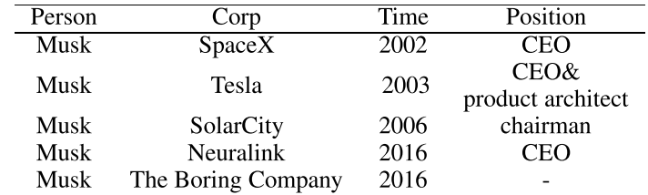

# 实体识别和关系抽取笔记

- 实体识别
- 

感觉这里理解的不是很好。。

**信息抽取**的定义为：从自然语言文本中抽取指定类型的实体、关系、事件等事实信息，并形成结构化数据输出的文本处理技术。
信息抽取是从文本数据中抽取特定信息的一种技术。文本数据是由一些具体的单位构成的，例如句子、段落、篇章，文本信息正是由一些小的具体的单位构成的，例如字、词、词组、句子、段落或是这些具体的单位的组合。抽取文本数据中的名词短语、人名、地名等都是文本信息抽取，当然，文本信息抽取技术所抽取的信息可以是各种类型的信息。

**说白了就是提取文本中的人名，地名，短语等各类信息**。

命名实体识别(NER)的任务是找到文本中提到的每个命名实体，并标记其类型。构成命名实体类型的是特定于任务的;人员、地点和组织是常见的。一旦提取了文本中的所有命名实体，就可以将它们链接到与实际实体相对应的集合中。

**关系抽取：**发现和分类文本实体之间的语义关系。这些关系通常是二元关系，如子女关系、就业关系、部分-整体关系和地理空间关系。

## 事件抽取任务定义


**事件抽取**：主要任务就是在已知「事件类型」的前提下，从句中抽取事件的各个**元素（论元）**，并判别事件元素的角色（论元角色）。事件抽取的子任务包括（以ACE2005中采用的事件标注标准为例）

**触发词识别**：即识别事件类型。触发词能够清晰表明某类事件的发生，例如“出生”、“离职”等。这个可以理解为识别动词嘛？

**事件元素抽取与角色分类：**事件元素的角色通常由两部分组成：事件参与者和事件属性。事件参与者是事件的必要部分，通常是命名实体的人名和组织机构名。事件属性包括通用事件属性和事件相关属性。

**事件整体特性：**除了事件类型和事件元素之外，事件的整体特性也经常被作为信息抽取的对象。例如：极性（正面/负面）、语态（确定/未知）、泛型（具体/普遍）、时态（过去/现在/将来/未知）。

## 流水线模型

1.使用**流水线(pipline)方法**进行抽取：先对句子进行实体识别，然后对识别出的实体两两组合，再进行关系分类，最后把存在实体关系的三元组做为输入。

### pipline的缺点

缺点：

1.错误传播，实体识别模块的错误会影响下面的关系分类性能。
2.差生了没必要的冗余信息，没有关系的实体会带来多余信息，提升错误率。错误会在不同组件之间传播，造成错误的累积；关系抽取只是利用了NER任务的结果，造成一个任务中可能对其他任务有用的信息没有被用到。

**也就是pipline模型会造成误差累计，实体冗余等目前很少使用了**

## 联合模型

2.实体识别和关系抽取的**联合模型**：对句子同时做实体识别和关系抽取得到一个有关系的实体三元组。[NeilGY](https://blog.csdn.net/NeilGY/article/details/87966676)

**联合模型**：有的需要人工特征，虽然利用神经网络已经可以不人工选特征了，但是会依赖于很多NLP工具，如pos标注、依存分析；单个实体的多个关系抽取还存在问题。

目前感觉用到的多的是**联合模型**

- pos标注


### 依存句法

>依存句法分析( Dependency Parsing, DP) 通过分析语言单位内成分之间的依存关系揭示其句法结构。

感觉像小学生的造句或者说缩写

文信息的研究中，中国学者提出了依存关系的第五条公理）：
一个句子中只有一个成分是独立的，即核心成分；
句子的其他成分都从属于某一成分，即除了核心成分外的部分；
任何一个成分都不能依存于两个及以上的成分；
如果成分A直接从属成分B，而成分C在句子中位于A和B之间，那么，成分C或者从属于A，或者从属于B，或者从属于A和B之间的某一成分（如果将从属关系用线条表示出来的话，那么这些线条不会发生交交错）；
核心成分左右两边的其他成分相互不发生关系，相当于核心成分是一条界线，左右两边的部分不再发生支配关系
[少儿西笑](https://blog.csdn.net/weixin_42936560/article/details/81702169)

举个例子给出一段文本

```r
In 2002, Musk founded SpaceX, an aerospace manufacturer and space transport services Company, of which he is CEO and lead designer. He helped fund Tesla, Inc., an electric vehicle and solar panel manufacturer, in 2003, and became its CEO and product architect. In 2006, he inspired the creation of SolarCity, a solar energy services Company, and operates as its chairman. In 2016, he co-founded Neuralink, a neurotechnology Company focused on developing brain–computer interfaces, and is its CEO. In 2016, Musk founded The Boring Company, an infrastructure and tunnel construction Company.
```

We need to extract four different types of entities, i.e., Person, Company, Time and Position,and three types of relations, FOUND, FOUNDING TIME and SERVING-ROLE. The text is to be transformed into a structural dataset shown in Table 1.


>Most existing models approach this task by extracting a list of triples from the text, i.e.,
REL(e1, e2), which denotes that relation REL holds between entity e1 and entity e2. Previous models
fall into two major categories: the pipelined approach, which first uses tagging models to identify
entities, and then uses relation extraction models to identify the relation between each entity pair;
and the joint approach, which combines the entity model and the relation model throught different
strategies, such as constraints or parameters sharing.


- 大多数现有的模型通过从文本中提取三元组列表来完成此任务，即REL(e1;e2)表示实体e1与实体e2之间的关系REL。以前的模型主要分为两大类:流水线方法，它首先使用标记模型来识别实体，然后使用关系提取模型来识别每个实体对之间的关系.

- 联合方法通过约束或参数共享等不同策略，将实体模型与关系模型相结合。

>There are several key issues with current approaches, both in terms of the task formalization
and the algorithm. At the formalization level, the REL(e1, e2) triplet structure is not enough to fully
express the data structure behind the text. Take the Musk case as an example, there is a hierarchical dependency between the tags: the extraction of Time depends on Position since a Person can hold multiple Positions in a Company during different Time periods. The extraction of Position also depends on Company since a Person can work for multiple companies. At the algorithm level, for most existing relation extraction models (Miwa and Bansal, 2016; Wang et al., 2016a;Ye et al., 2016), the input to the model is a raw sentence with two marked mentions, and the output is whether a relation holds between the two mentions. As pointed out in Wang et al. (2016a);Zeng et al. (2018), it is hard for neural models to capture all the lexical, semantic and syntactic cues in this formalization, especially when (1) entities are far away; (2) one entity is involved in multiple triplets; or (3) relation spans have overlaps.

当前的方法在任务形式化和算法方面存在几个关键问题。
- 在形式化层次上，REL(e1;e2)三元组结构不足以充分表达文本背后的数据结构。
- 以Musk为例，标签之间存在层次依赖关系:时间的提取依赖于位置，因为一个人可以在不同的时间段内担任公司的多个位置。职位的选择也取决于公司，因为一个人可以在多家公司工作。在算法层面，对于大多数现有的关系提取模型(Miwa和Bansal, 2016;王等，2016a;(Ye et al.， 2016)，模型的输入是两个标记提及的原始语句，输出是两个提及之间是否存在关系。Wang et al. (2016a)指出;Zeng et al.(2018)，在这种形式化过程中，神经模型很难捕捉到所有的词汇、语义和句法线索，特别是当

- (1)实体距离较远的时候;
- (2)一个实体涉及多个三元组;
- (3)关系跨有重叠。

许多早期的实体-关系提取系统都是流水线的(Zelenko et al.， 2003;Miwa等人，2009;陈和罗斯，2011年;Lin et al.， 2016):实体提取模型首先识别感兴趣的实体，然后关系提取模型构建被提取实体之间的关系。尽管流水线系统可以灵活地集成不同的数据源和学习算法，但是它们会受到错误传播的严重影响。

为了解决这一问题，提出了联合学习模型。早期的联合学习方法通过各种依赖关系将两个模型连接起来，包括用整数线性规划求解的约束(Yang and Cardie, 2013;Roth和Yih, 2007)，卡片金字塔解析(Kate和Mooney, 2010)，和全球概率图形模型(Yu和Lam,2010;辛格等人，2013)。在后来的研究中，Li和Ji(2014)使用结构化感知器和有效的集束搜索来提取实体提及和关系，这比基于约束的方法更有效，更省时。Miwa和Sasaki (2014);Gupta等人(2016);Zhang等人(2017)提出了表格填充方法，该方法提供了将更复杂的特征和算法纳入模型的机会，如解码中的搜索顺序和全局特征。神经网络模型在文献中也得到了广泛的应用。Miwa和Bansal(2016)提出了一种端到端方法，使用具有共享参数的神经网络模型提取实体及其关系，即，使用神经标记模型提取实体，使用基于树LSTMs的神经多类分类模型提取关系(Tai et al.， 2015)。Wang等人(2016a)利用多级注意力CNNs提取关系。Zeng等人(2018)提出了一种新的框架，利用序列到序列模型生成实体关系三元组，将实体检测与关系检测自然地结合起来。

**这段话就是为了举例子，写了一下近年来的文献综述，其实就是在pipline之后联合模型的不断改进。**


另一种将实体和关系提取模型进行绑定的方法是采用强化学习或最小风险训练，其中训练信号是基于两个模型的联合决策给出的。Sun等(2018)优化了全局损失函数，在最小风险训练框架下联合训练两个模型。Takanobu等(2018)采用分层强化学习的方法，以分层的方式提取实体和关系。


## 命名实体识别NER

>信息提取的第一步是检测文本中的实体。一个命名实体，粗略地说，是任何可以用一个专有名称引用的东西:一个人、一个位置、一个组织。这个术语通常被扩展为包含本身不是实体的东西，包括日期、时间和其他类型的时态表达式，甚至像价格这样的数字表达式。
命名实体识别是指查找构成专有名称的文本范围，然后对实体的类型进行分类。识别困难的原因之一是**分割的模糊性**，我们需要决定什么是实体，什么不是，界限在哪里。另一个困难是类型模糊。JFK可以指一个人、纽约的机场、美国各地的学校、桥梁和街道。[CSDN](https://blog.csdn.net/qq_27590277/article/details/106263861)

### NE序列标注

[ibo](figs/ibo.png)


## 对抗训练

>抗训练的思路，就是在输入上进行梯度上升(增大loss)，在参数上进行梯度下降(减小loss)。由于输入会进行embedding lookup，所以实际的做法是在embedding table上进行梯度上升。[知乎专栏](https://zhuanlan.zhihu.com/p/103593948)


## 关系抽取

> 关系抽取实际上和文本分类，情感分析类似吧，都是做sentences层面的分类，无非是关系抽取多了两个实体。


