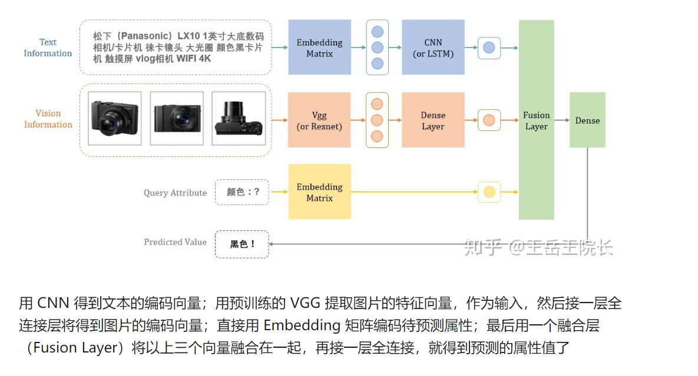
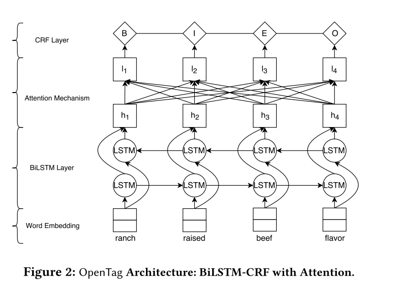
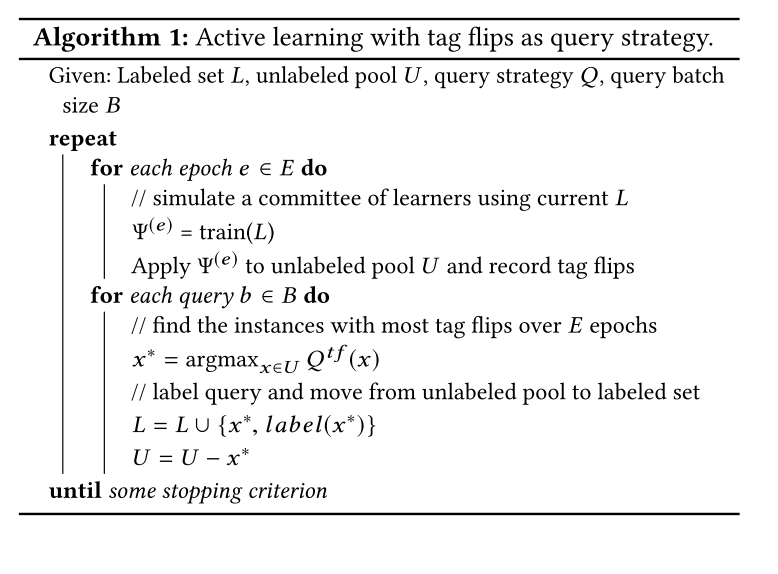

# 属性抽取

从实体关系讲起

实体关系相当于事物与事物之间的联系，而属性，则丰富了我们对事物本身的认识。

什么是属性抽取：现实世界的任何事物，都要靠若干属性来修饰和描述，比如你买了一个肉夹馍，它的“肉料”是“牛肉”还是“猪肉”，它的“口味”是“麻辣”还是“不辣”，都需要被描述清楚，你才能做出决定想不想吃，要不要买

那到哪去获取这些“属性描述”呢？你可以看看菜单上写没写，也可以直接问老板，简单直接，但是这些“原始数据”不总是完美的。万一老板今天心情不好，不乐意跟你说话，怎么办。你就需要靠自己。你往冷柜一看，上面写着是“牛肉”的，再往调料盘一看，没有辣椒粉的罐子，就推理出应该是“不辣”的。挺好，开心地点了一个吃，做了一次成功的“属性抽取”，被自己的机智所折服

但是也有可能，你吃着发现，是辣的，吐了。原来老板把辣椒粉装在别的罐子里了。这个故事告诉我们，“属性抽取”也是有风险的，因为原始数据也是有噪声的

>医疗文本中也存在描述实体属性的信息，如："通过用手**搔抓**患癣的部位如足趾间，或与患者共用鞋袜、手套、浴巾、脚盆等是**手癣**的主要传播途径。"中，"手癣"的"传播途径"是"用手搔抓患……"。又如"发生**丙肝**的主要原因是**丙型肝炎病毒**"中，"丙肝"的"主要原因"是"丙型肝炎病毒"。

通过例子可以发现，**属性名通常是一个名词短语**，但是属性值可以是词，也可以是句子，属性的概念本身就具备较宽泛的灵活性，学界目前也没有一个统一的标准，所以**需要在具体落地场景中根据实际情况做相应的设**计。

##  抽取方法

**抽取式：**就是抽取输入文本中的字词，组成预测的属性值。也就是说，预测出的属性值一定要在输入侧出现过

实现上，可以用上图所示的序列标注的方式，也可以做成类似 SQuAD 那种的 QA 问题，把属性作为 query，把属性值作为 answer，最终输出两个 index，取原文中两个 index 之间的字词作为属性值

另外，用序列标注的方式做的话，也有不同的实现方式，比如不把待预测的属性名（Query Attribute）作为输入，而是作为输出。也就是说，不告诉模型想预测哪个属性，模型你觉得你能预测到哪个属性就输出哪个属性。这种实现方式也包括几种，比如可以做成一个多任务学习，一个子任务做分类预测属性名，一个子任务做序列标注标记属性值；也可以只做一个序列标注任务，属性名靠标签本身标记，例如把原本的“B”标签扩展成“B-口味”“B-肉料”等多个标签，每个标签对应一种属性。五花八门，百川入海，殊途同归。

## 生成式

>只能预测可枚举的高频属性，导致很多属性值不可做
预测出来的属性值没有可解释性，在实际业务中，预测出来结果也不一定敢用（比如模型预测出来这个肉夹馍用的是牛肉，但是你也不一定敢信，又看不出来，万一是假的）

## 属性抽取的难点

>属性抽取较之关系抽取的难点在于，除了要识别实体的属性名还要识别实体的属性值，而属性值结构也是不确定的，因此大多研究都是基于规则进行抽取，面向的也是网页，query，表格数据。但是这种方法在医疗领域数据上有一定的弊端，因为医疗知识图谱不同于常识性知识图谱，它对于信息的质量有着很高的要求，对信息噪音的容错性也较低。

## 应用场景

医疗信息抽取

提取零售/流行产品的属性

人物属性抽取：还有一个专门的数据集合集：https://github.com/MAJIN123/Distant-Supervision-for-Person-Attribute-Extraction

找到一个事件抽取和事件要素抽取的baseline
https://zhuanlan.zhihu.com/p/133783503

数据见：https://www.datafountain.cn/competitions/361/datasets

github传送门见：https://github.com/gaozhanfire/CCF-BDCI2019_Entity_Discovery

## Multimodal Attribute Extraction

参考一篇多模态的属性抽取方法见https://www.paperswithcode.com/paper/multimodal-attribute-extraction

除了处理结构化的文本数据之外还可以处理table，picture，video等

结构图[院长日常](https://zhuanlan.zhihu.com/p/144268850)

**数据**见：https://rloganiv.github.io/mae/

如果只用文本的话，可以只使用数据的文本部分

## Scaling Up Open Tagging from Tens to Thousands Comprehension Empowered Attribute Value Extraction from Product Title

将属性收取转化为了序列标注的问题

输入数据：title，attribute 文本数据

- 将attribute集合中的各个属性对应的编码与title的编码进行attention计算，之后经过CRF层输出标签，

输出数据：attribute 的BIO tag

- 这里输出的标签只有三种：{B,I,O}，对每一个属性进行以上操作后，根据输出结果的标签，即可提取出对应的属性值，属性值没有数量限制，可能输出多个值，也可能没有对应值（即所有标签均为O）。

是pytorch写的，

github传送门见：https://github.com/hackerxiaobai/OpenTag_2019

这个里面包含数据，预处理过程，模型，可以直接运行main函数

## OpenTag: Open Att ribute Value Extraction from Product Profiles

>In this work, we leverage product profile information such as titles and descriptions to discover missing values of product attributes.

这篇文章是从product中产品名和描述中提取属性的

主要贡献如下

>(1) we formalize the problem as a sequence tagging task, and propose a joint model exploiting recurrent neural networks (specifi cally, bidirectional LSTM) to capture context and semantics, and Conditional Random Fields (CRF) to enforce tagging consistency; 

将属性抽取问题转化为序列标注问题，提出一个联合抽取模型：LSTM+CRF+attention

>(2) we develop a novel attention mechanism to provide interpretable explanation for our model’s decisions; 

加入attention机制

>(3) we propose a novel sampling strategy exploring active learning to reduce the burden of human annotation.OpenTag does not use any dictionary or hand-crafted features as in prior works.Extensive experiments in real-life datasets in different domains show that OpenTag with our active learning strategy discovers new attribute values from as few as 150 annotated samples
(reduction in 3 . 3x amount of annotation eff ort) with a high F-score of 83%, outperforming state-of-the-art models.

>OpenTag does not use any dictionary or hand-crafted feature

opentag可以自动采样进行标注，无需人工。f1 score达到83%

当前存在的**problem**

>Given a set of product profiles presented as unstructured text data (containing information like titles, descriptions, and bullets), and a set of pre-defined target attributes (e.g., brand , fl avor , size ), our objective is to extract corresponding attribute values from unstructured text.

如何从结构化文本中提取属性值

>We have an OWA assumption where we want to discover new attribute values that may not have been encountered before. Note that we assume the target attributes (and not attribute-values) for each domain are given as input to the system.

当要提取的属性值在之前的数据中未曾出现过，如何处理,即能否通过有限的标注数据建模

这个是半监督嘛？

>OpenTag automatically figures out the set of applicable attribute-values for each product in the domain. 

openTag可以主动学习提取属性值
 

### Sequence Tagging Approach

>. In order to model the above dependencies between attributes and values, we adopt the sequence tagging approach. **In particular, we associate a tag from a given tagset to each token in the input sequence. The objective is to jointly predict all the tags in the input sequence. In case of named entity recognition (NER), the objective is to tag entities like (names of) persons,
locations, and organizations in the given input sequence. **Our problem is a specifi c case of NER where we want to tag attribute values given an input sequence of tokens. The idea is to exploit distributional semantics , where similar sequences of tags for tokens identify similar concepts.

将属性抽取转化为类似于实体识别的序列标注的方式进行抽取

一个属性可能对应多个不同的属性值

本文采取的标注策略是BIOE

>‘E’ represents the end of an attribute.

B是属性的开始，E代表属性值的结束

### 模型结构

### ACTIVE LEARNING

主动学习机制

主动学习的主要思路

是根据少量的有标签样本训练初始模型，对未知样本进行预测，
然后设定询问策略，将符合标准的样本进行标注，加入有标签训练集，如此循环，直到达到设定的停止标准。
本文主动学习关键点在于**询问策略制定**，采用了标签翻转（tag flips）作为评判指标，
通俗讲就是，选择一组序列中，在多个epoch内，模型预测标签变化次数最多的序列，进行人工标注。

## 参考文献
