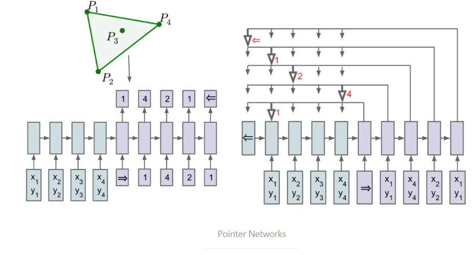

## Pointer Networks

指针网络

任务类型
在某些任务中，输入严格依赖于输入，或者说输出只能从输入中选择。例如输入一段话，提取这句话中最关键的几个词语。又或是输入一串数字，输出对这些数字的排序。这时如果使用传统seq2seq模型，则忽略了输入只能从输出中选择这个先验信息，Pointer Networks正是为了解决这个问题而提出的。

**基本模型**

Pointer Networks模型非常简洁，结构是基本的seq2seq + attention。对于传统的attention模型，在计算权重之后会对encoder的state进行加权，求得一个向量。而Pointer Networks则在计算权重之后，选择概率最大的encoder state最为输出。示意图如下:[l1n3x](https://www.jianshu.com/p/9cc4dd96f7cd)

论文中使用了寻找闭包这个任务作为例子。简单的说，寻找闭包是从输入的点中找到一些点能把所有的点围起来。例如左上角图的闭包是(p1,p2,p4,p1)。左下角则是使用传统的seq2seq模型来解决这个任务，右边则是使用Pointer Networks。其中箭头指向的则是对应时间步的输出。采用这种方式就能解决输出只能从输入中选择的问题，可谓是大道至简。
