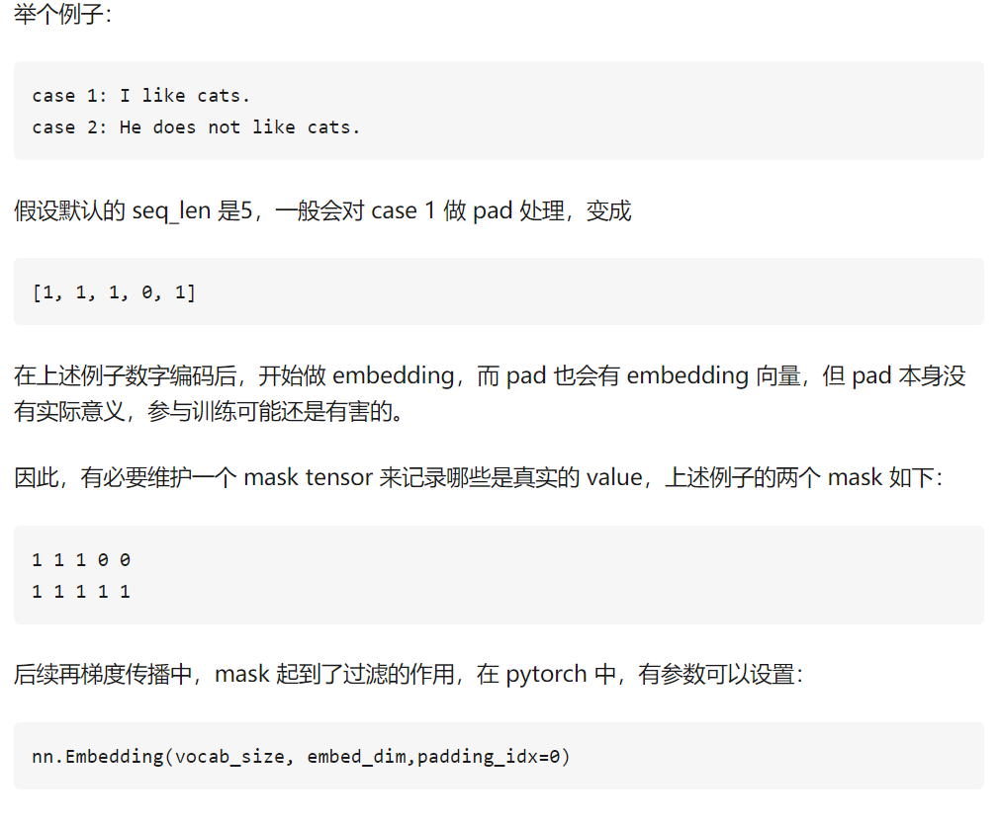
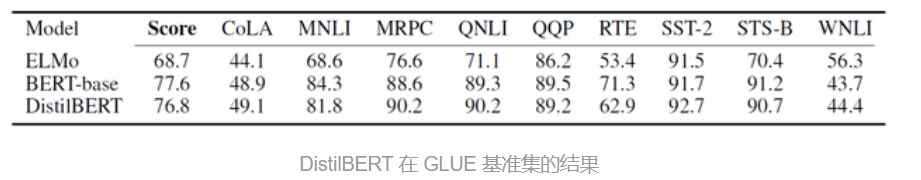
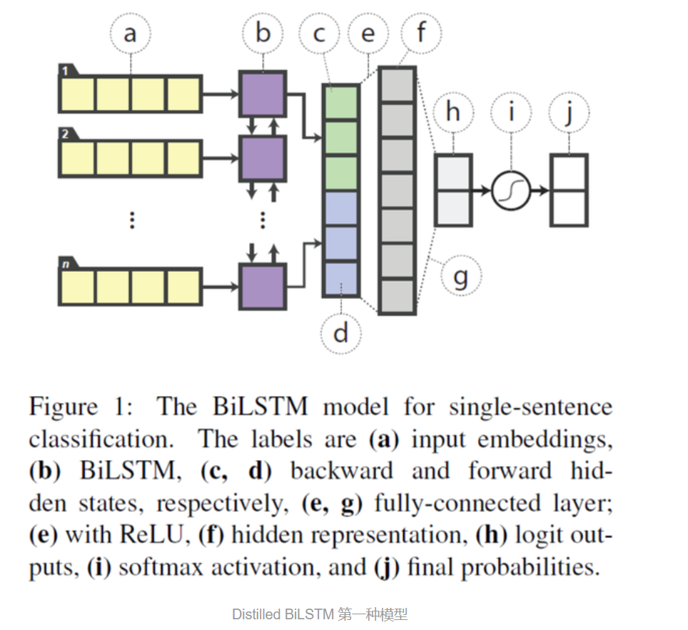
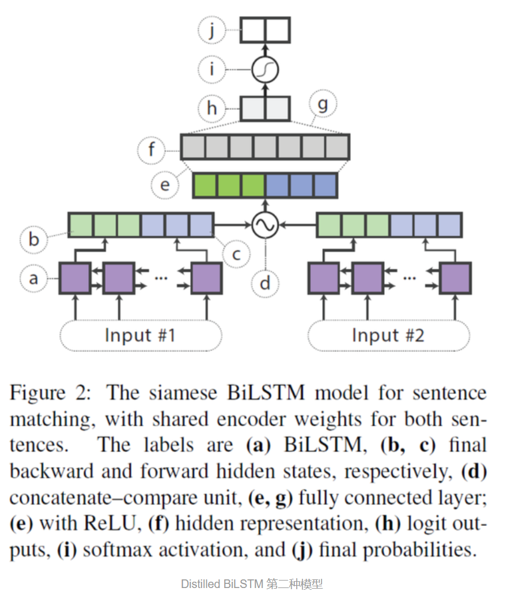
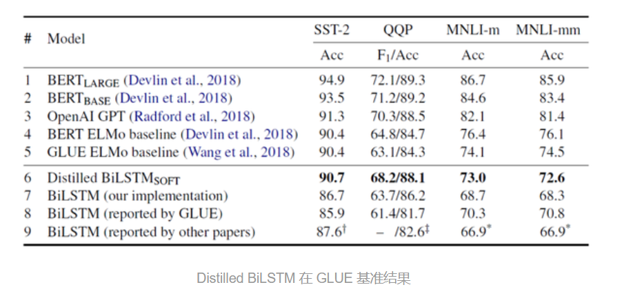
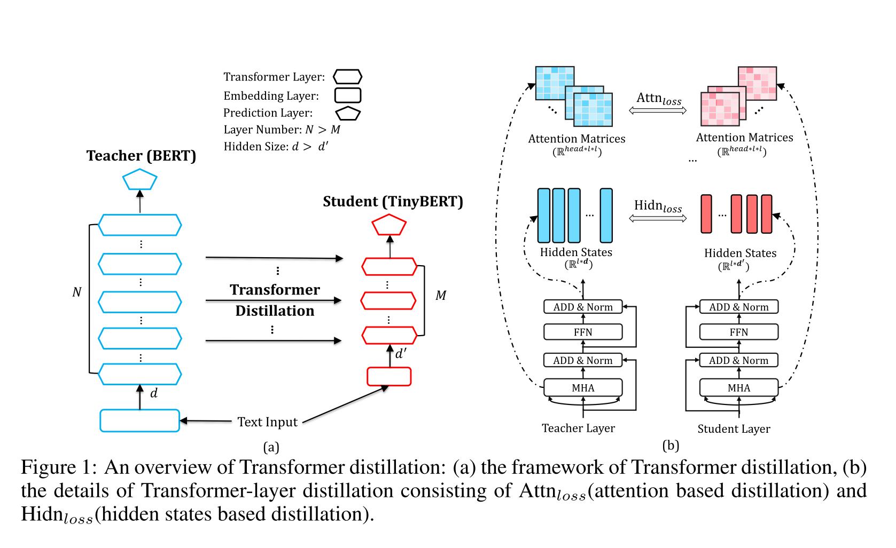
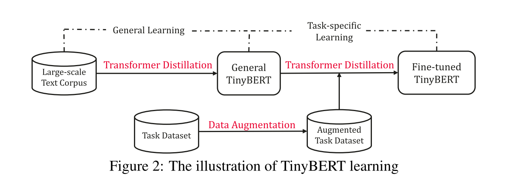
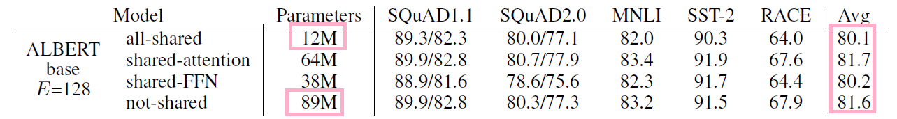
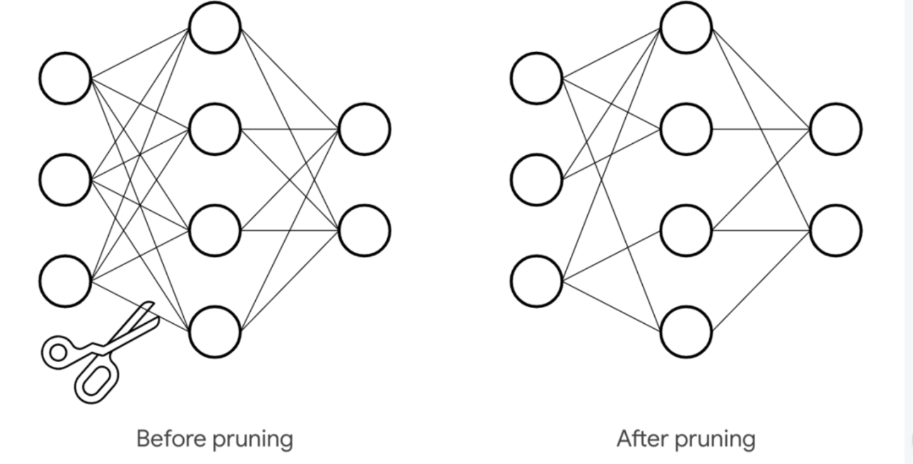

# BERT学习笔记

## Transformer

```{r child='analysis/transformer.Rmd'}

```


## BERT

```{r child='analysis/bert.Rmd'}

```


## 蒸馏机制

通过迁移知识，从而通过训练好的大模型得到更加适合推理的小模型[简书](https://www.jianshu.com/p/81681380ddbc)


可以从下面的几个方面来理解KD

>Knowledge Distill是一种简单弥补分类问题监督信号不足的办法。传统的分类问题，模型的目标是将输入的特征映射到输出空间的一个点上，例如在著名的Imagenet比赛中，就是要将所有可能的输入图片映射到输出空间的1000个点上。这么做的话这1000个点中的每一个点是一个one-hot编码的类别信息。这样一个label能提供的监督信息只有log(class)这么多bit。然而在KD中，我们可以使用teacher-model对于每个样本输出一个连续的label分布，这样可以利用的监督信息就远比one hot的多了。

这里的解释没太懂~


>另外一个角度的理解，大家可以想象**如果只有label这样的一个目标的话，那么这个模型的目标就是把训练样本中每一类的样本强制映射到同一个点上，这样其实对于训练很有帮助的类内variance和类间distance就损失掉了**。


>然而使用teacher model的输出可以恢复出这方面的信息。

teacher不仅告诉你结果，还把解题过程的每一步详细的解释了，方便学生进一步理解，没准能学习到更多的知识。


>具体的举例就像是paper中讲的，猫和狗的距离比猫和桌子要近，同时如果一个动物确实长得像猫又像狗，那么它是可以给两类都提供监督。

解决相似的样本分类问题，这样保留了两类的监督不留信息损失~

>综上所述，KD的核心思想在于"打散"原来压缩到了一个点的监督信息，让student模型的输出尽量match teacher模型的输出分布。其实要达到这个目标其实不一定使用teacher model，在数据标注或者采集的时候本身保留的不确定信息也可以帮助模型的训练。当然KD本身还有很多局限，比如当类别少的时候效果就不太显著，对于非分类问题也不适用。[Naiyan Wang](https://www.zhihu.com/question/50519680/answer/136363665)

### softtarget机制

用soft target来辅助hard target一起训练，而soft target来自于大模型的预测输出。这里有人会问，明明true label（hard target）是完全正确的，为什么还要soft target呢？

>hard target 包含的信息量（信息熵）很低，soft target包含的信息量大，拥有不同类之间关系的信息（比如同时分类驴和马的时候，尽管某张图片是马，但是soft target就不会像hard target 那样只有马的index处的值为1，其余为0，而是在驴的部分也会有概率。）

hard target就是true target，仅仅只包含一个类label

>这样的好处是，这个图像可能更像驴，而不会去像汽车或者狗之类的，而这样的soft信息存在于概率中，以及label之间的高低相似性都存在于soft target中。但是如果soft targe是像这样的信息[0.98 0.01 0.01]，就意义不大了，所以需要在softmax中增加温度参数T（这个设置在最终训练完之后的推理中是不需要的）[大饼博士X](https://blog.csdn.net/xbinworld/article/details/83063726)

$q_{i}=\frac{\exp \left(z_{i} / T\right)}{\Sigma_{j} \exp \left(z_{j} / T\right)}$


其实可以理解为给label做label space增强，扩大label的可能性。

- 只用于分类的问题


## DistilBERT


- 主旨就是从复杂网络（teacher net）中**抽取训练数据的分布**‘教给’简易网络（student net）

- 迁移学习的思路


首先介绍模型蒸馏的概念，模型蒸馏是一种模型压缩的方法，由 Hinton 在论文《Distilling the Knowledge in a Neural Network》中提出，下面是模型蒸馏的要点：

- 1）给定原始的bert-base作为teacher网络。

- 2）在bert-base的基础上将网络层数减半（也就是从原来的12层减少到6层）。

- 3）利用teacher的软标签和teacher的隐层参数来训练student网络。

训练时的损失函数定义为三种损失函数的线性和，三种损失函数分别为：

　　1）Lce。这是teacher网络softmax层输出的概率分布和student网络softmax层输出的概率分布的交叉熵（注：MLM任务的输出）。

　　2）Lmlm。这是student网络softmax层输出的概率分布和真实的one-hot标签的交叉熵

　　3）Lcos。这是student网络隐层输出和teacher网络隐层输出的余弦相似度值，在上面我们说student的网络层数只有6层，teacher网络的层数有12层，因此个人认为这里在计算该损失的时候是用student的第1层对应teacher的第2层，student的第2层对应teacher的第4层，以此类推。

　　作者对student的初始化也做了些工作，作者用teacher的参数来初始化student的网络参数，做法和上面类似，用teacher的第2层初始化student的第1层，teacher的第4层初始化student的第2层。

　　作者也解释了为什么减小网络的层数，而不减小隐层大小，**作者认为在现代线性代数框架中，在张量计算中，降低最后一维（也就是隐层大小）的维度对计算效率提升不大，反倒是减小层数，也提升计算效率。**

　　另外作者在这里移除了句子向量和pooler层，在这里也没有看到NSP任务的损失函数，因此个人认为作者也去除了NSP任务（主要是很多人证明该任务并没有什么效果）。

　　整体上来说虽然方法简单，但是效果还是很不错的，模型大小减小了40%（66M），推断速度提升了60%，但性能只降低了约3%。

这种方法感觉受到了ensemble的启发，利用大型（teacher net）网络提取先验知识，将这种先验知识作为soft target让微型网络（student network）学习,有点像Boost中第一个分类器学到后调整weight让第二个分类器学习。当然相似中也有不同之处


**DistilBERT 模型与 BERT 模型类似，但是 DistilBERT 只有 6 层，而 BERT-base 有 12 层，DistilBERT 只有 6600 万参数，而 BERT-base 有 1.1 亿参数。在某些数据集上面可以达到95%。**

DistilBERT 使用 KL 散度作为损失函数，q 表示 student 模型的分布，而 p 表示 teacher 模型输出的分布，损失函数如下：

$K L(p \| q)=E_{p}\left(\log \left(\frac{p}{q}\right)\right)=\sum_{i} p_{i} \times \log \left(p_{i}\right)-\sum_{i} p_{i} \times \log \left(q_{i}\right)$

DistilBERT 最终的损失函数由 KL 散度 (蒸馏损失) 和 MLM (遮蔽语言建模) 损失两部分线性组合得到。**DistilBERT 移除了 BERT 模型的 token 类型 embedding 和 NSP (下一句预测任务)，保留了 BERT 的其他机制，然后把 BERT 的层数减少为原来的 1/2。**

此外 DistilBERT 的作者还使用了一些优化的 trick，例如使用了 teacher 模型的参数对 DistilBERT 模型进行初始化；采用 RoBERTa 中的一些训练方法，例如**大的 batch**，**动态 Mask** 等。


### mask

- padding mask 

处理输入不定长在 NLP 中，一个常见的问题是输入序列长度不等，一般来说我们会对一个 batch 内的句子进行 PAD，通常值为 0。但在前面我们也讲过，PAD 为 0 会引起很多问题，影响最后的结果，因此，Mask 矩阵为解决 PAD 问题而产生。
。[随时学丫](https://www.zhihu.com/question/320615749/answer/1080485410)



- sequence mask 

>防止未来信息泄露在语言模型中，常常需要从上一个词预测下一个词，sequence mask 是为了使得 decoder 不能看见未来的信息。也就是对于一个序列，在 time_step 为 t 的时刻，我们的解码输出应该只能依赖于 t 时刻之前的输出，而不能依赖t之后的输出。因此我们需要想一个办法，把t之后的信息给隐藏起来。那么具体怎么做呢？也很简单：产生一个上三角矩阵，上三角的值全为 1，下三角的值全为 0，对角线也是 0。把这个矩阵作用在每一个序列上，就可以达到我们的目的啦。


### 优化效果




## Distilled BiLSTM

>即teacher模型是BERT，而student模型是BiLSTM，这个模型的压缩效果很强，但是精度相比bert还是差很多的


具体效果有待验证~

一种 BiLSTM 模型:
用于单个句子的分类，将句子的所有单词的词向量输入一个 BiLSTM，然后将前向和后向LSTM 的隐藏层向量拼接在一起，传入全连接网络中进行分类。





$f\left(h_{1}, h_{2}\right)=\left[h_{1}, h_{2}, h_{1} \odot h_{2},\left|h_{1}-h_{2}\right|\right]$

将 BERT 蒸馏到 BiLSTM 模型，使用的损失函数包含两个部分：

一部分是 hard target，直接使用 one-hot 类别与 BiLSTM 输出的概率值计算交叉熵。
一部分是 soft target，使用 teacher 模型 (BERT) 输出的概率值与 BiLSTM 输出的概率值计算均方误差 MSE。

\[
\begin{array}{c}
y=\operatorname{softmax}(z) \\
L_{\text {distil}}=\left\|z^{(B)}-z^{(S)}\right\|_{2}^{2} \\
L=\alpha \cdot L_{C E}+(1-\alpha) \cdot L_{\text {distil}}
\end{array}
\]
$z^{(B) \text { 是 } \text {teacher} \text { 模型的输出 }}$ $z^{(S) \text { 是student模型的输出 }}$

这个数据增强的方法，真实的比较大型的数据集应该是不需要的？


在训练过程中，太小的数据集不足以让 student 模型学习到 teacher 模型的所有知识，所以作者提出了三种数据增强的方法扩充数据：

Masking，使用 [mask] 标签随机替换一个单词，例如 "I have a cat"，替换成 "I [mask] a cat"。
POS-guided word replacement，将一个单词替换成另一个具有相同 POS 的单词，例如将 "I have a cat" 替换成 "I have a dog"。
n-gram，在 1-5 中随机采样得到 n，然后采用 n-gram，去掉其他单词。

### 模型效果


BiLSTM 的参数要远远少于 BERT-large，比 BERT-large 少了 335倍，推断时间比 BERT-large 快了434倍。压缩效果还是比较明显的。



蒸馏有个缺点就是不太稳定？

解释一下why？


## fastbert

自适应推理时间的新型可调速FastBERT

繁重的模型可能会过多地计算简单的输入，而较简单的模型则可能在复杂样本中失败。预训练模型具有冗余性。基于这个发现，我们提出了FastBERT，这是一种具有样本自适应机制（sample-wise adaptive mechanism）的预训练模型。 它可以动态调整执行的层数以减少计算步骤。 该模型还具有独特的自蒸馏（self-distillation)过程，该过程仅需对结构进行最小的更改，即可在单个框架内以更快的速度获得准确的结果。[睡熊猛醒](https://blog.csdn.net/weixin_41089007/article/details/105437979)

就是**在每层Transformer后都去预测样本标签，如果某样本预测结果的置信度很高，就不用继续计算了**。论文把这个逻辑称为样本自适应机制（Sample-wise adaptive mechanism），就是**自适应调整每个样本的计算量，容易的样本通过一两层就可以预测出来**，较难的样本则需要走完全程。

预测中间层的方法是：每层后面连接一个分类器~

论文整体的框架~

- pre-training：同BERT系模型是一样的，主干模型可以随便换，只要是BERT系的都行（ BERT-WWM, RoBERTa, ERNIE等等）。更舒服的是，FastBERT甚至不需要自己执行预训练，因为它可以自由加载高质量的预训练模型。

- Fine-tuning for Backbone：主干精调，也就是给BERT最后一层加上分类器，用任务数据训练，这里也用不到分支分类器，可以尽情地优化。

- Self-distillation for branch：分支自蒸馏，用无标签任务数据就行，将主干分类器预测的概率分布蒸馏给分支分类器。这里使用KL散度衡量分布距离，loss是所有分支分类器与主干分类器的KL散度之和。


作者将原BERT模型称为主干（Backbone），每个分类器称为分支（Branch）。

要注意的是，**这里的分支Classifier都是最后一层的分类器蒸馏来的，作者将这称为自蒸馏（Self-distillation）。就是在预训练和精调阶段都只更新主干参数，精调完后freeze主干参数，用分支分类器（图中的student）蒸馏主干分类器（图中的teacher）的概率分布**。

之所以叫自蒸馏，是因为之前的蒸馏都是用**两个**模型去做，一个模型学习另一个模型的知识，而FastBERT是自己（分支）蒸馏自己（主干）的知识。值得注意的是，蒸馏时需要freeze主干部分，保证pretrain和finetune阶段学习的知识不被影响，**仅用brach来尽可能的拟合teacher的分布**。

>使用自蒸馏还有一点重要的好处，就是**不再依赖于标注数据**。蒸馏的效果可以通过源源不断的无标签数据来提升。


>通过提前输出简单样本的预测结果，减少模型的计算负担，从而提高推理速度。虽然每层都多了一个分类器，但分类器的计算量也比Transformer小了两个数量级，对速度影响较小。后续的分支自蒸馏也设计的比较巧妙，可以利用无监督数据不断提升分支分类器的效果。

另外，fastbert两个创新点：

- 样本自适应机制：**Sample-wise adaptive mechanism**

>在每层Transformer后都去预测样本标签，如果某样本预测结果的置信度很高，就不用继续计算了，就是自适应调整每个样本的计算量，容易的样本通过一两层就可以预测出来，较难的样本则需要走完全程。 直接上图，一目了然。

- 自我蒸馏：**Self-distillation**


论文本身也还有一些想象空间，比如**分别优化每层分类器**，因为在主干被freeze的情况下各个分支是独立的；或者自蒸馏后unfreeze主干，再**加上有标签数据自蒸馏一把**，说不定还会有性能提升。

代码见：https://github.com/autoliuweijie/FastBERT


非蒸馏的结果没有蒸馏的好？

why?查一下相关issue

- [ ] 都看看找找思路吧

https://www.jianshu.com/p/0b9970c4400a


## Tinybert

效果

>TinyBERT is empirically effective and achieves more than 96% the performance
of teacher BERT BASE on GLUE benchmark, while being 7.5x smaller and 9.4x
faster on inference. TinyBERT is also significantly better than state-of-the-art
baselines on BERT distillation, with only ∼28% parameters and ∼31% inference
time of them.

能达到原有bert的96%,速度提提升7.5~9.4倍

### transformer 蒸馏法

几乎是对每一层都进行了蒸馏~

```{r}

```

- Transformer 层蒸馏

>Problem Formulation. Assuming that the student model has $M$ Transformer layers and teacher model has $N$ Transformer layers, we choose $M$ layers from the teacher model for the Transformerlayer distillation. The function $n=g(m)$ is used as a mapping function from student layers to teacher layers, which means that the $m$ -th layer of student model learns the information from the $n$ th layer of teacher model. The embedding-layer distillation and the prediction-layer distillation are
also considered. We set 0 to be the index of embedding layer and $M+1$ to be the index of prediction layer, and the corresponding layer mappings are defined as $0=g(0)$ and $N+1=g(M+1)$ respectively. The effect of the choice of different mapping functions on the performances will be studied in the experiment section. Formally, the student can acquire knowledge from the teacher by minimizing the following objective:

假定 student 模型有 M 个 Transformer 层，teacher 模型有 N 个 Transformer 层，从 teacher 模型中选择 M 个 Transformer 层用于 Transformer 层蒸馏。n=g(m) 是 student 层到 teacher 层的映射函数，这意味着 student 模型的第 m 层从 teacher 模型的第 n 层开始学习信息。嵌入层蒸馏和预测层蒸馏也考虑进来，将嵌入层的指数设为 0，预测层的指数设为 M+1，并且对应的层映射分别定义为 0 = g(0) 和 N + 1 = g(M + 1)。


$\mathcal{L}_{\mathrm{model}}=\sum_{m=0}^{M+1} \lambda_{m} \mathcal{L}_{\mathrm{layer}}\left(S_{m}, T_{g(m)}\right)$

其中 L_layer 是给定模型层（如 Transformer 层或嵌入层）的损失函数，λ_m 是表征第 m 层蒸馏重要度的超参数。

- 基于注意力层的蒸馏

$\mathcal{L}_{\mathrm{atn}}=\frac{1}{h} \sum_{i=1}^{h} \operatorname{MSE}\left(\boldsymbol{A}_{i}^{S}, \boldsymbol{A}_{i}^{T}\right)$


- 对Transformer隐藏层进行蒸馏

$\mathcal{L}_{\mathrm{hidn}}=\operatorname{MSE}\left(\boldsymbol{H}^{S} \boldsymbol{W}_{h}, \boldsymbol{H}^{T}\right)$

>where the matrices $\boldsymbol{H}^{S} \in \mathbb{R}^{l \times d^{\prime}}$ and $\boldsymbol{H}^{T} \in \mathbb{R}^{l \times d}$ refer to the hidden states of student and teacher networks respectively, which are calculated by Equation 4 The scalar values $d$ and $d^{\prime}$ denote the hidden sizes of teacher and student models, and $d^{\prime}$ is often smaller than $d$ to obtain a smaller student network. The matrix $\boldsymbol{W}_{h} \in \mathbb{R}^{d^{\prime} \times d}$ is a learnable linear transformation, which transforms the hidden states of student network into the same space as the teacher network's states.

 $\boldsymbol{H}^{S} \in \mathbb{R}^{l \times d^{\prime}}$ and $\boldsymbol{H}^{T} \in \mathbb{R}^{l \times d}$ 分别表示学生网络和教师网络，就是为了的得到更小的student网络
 
- 嵌入层的蒸馏

与隐藏层蒸馏是类似

Embedding-layer Distillation. We also perform embedding-layer distillation, which is similar to the hidden states based distillation and formulated as:
\[
\mathcal{L}_{\mathrm{embd}}=\operatorname{MSE}\left(\boldsymbol{E}^{S} \boldsymbol{W}_{e}, \boldsymbol{E}^{T}\right)
\]
where the matrices $\boldsymbol{E}^{S}$ and $\boldsymbol{H}^{T}$ refer to the embeddings of student and teacher networks, respectively. In this paper, they have the same shape as the hidden state matrices. The matrix $W_{e}$ is a linear transformation playing a similar role as $\boldsymbol{W}_{h}$

- 蒸馏拟合teacher的预测结果

除了模拟中间层的行为之外，研究者还利用知识蒸馏来拟合 teacher 模型的预测结果。具体而言，他们对 student 网络 logits 和 teacher 网络 logits 之间的 soft 交叉熵损失进行惩罚：

其中 $z^S$ 和 $z^T $分别表示 student 和 teacher 模型预测的 logits 向量，log_softmax() 表示 log 似然，t 表示温度值。实验表明，t=1 时运行良好。

$\mathcal{L}_{\text {layer }}\left(S_{m}, T_{g(m)}\right)=\left\{\begin{array}{ll}\mathcal{L}_{\text {embd }}\left(S_{0}, T_{0}\right), & m=0 \\ \mathcal{L}_{\text {hidn }}\left(S_{m}, T_{g(m)}\right)+\mathcal{L}_{\text {attn }}\left(S_{m}, T_{g(m)}\right), & M \geq m>0 \\ \mathcal{L}_{\text {pred }}\left(S_{M+1}, T_{N+1}\right), & m=M+1\end{array}\right.$


### 两段式学习框架

```{r}

```


BERT的应用通常包含两个学习阶段：预训练和微调。BERT在预训练阶段学到的大量知识非常重要，并且迁移的时候也应该包含在内。因此，研究者提出了一个两段式学习框架，包含通用蒸馏和特定于任务的蒸馏。

- 通用蒸馏

在通用蒸馏中，研究者**使用原始BERT作为teacher模型，而且不对其进行微调，**利用大规模文本语料库作为学习数据。通过在通用领域文本上执行 Transformer 蒸馏，他们获取了一个通用 TinyBERT，**可以针对下游任务进行微调**。然而，由于隐藏/嵌入层大小及层数显著降低，通用 TinyBERT 的表现不如 BERT。

因此模型降参数主要在这里

- 针对特定任务的蒸馏

研究者提出通过针对特定任务的蒸馏来获得有竞争力的微调 TinyBERT 模型。而在蒸馏过程中，他们在针对特定任务的增强数据集上（如图 2 所示）重新执行了提出的 Transformer 蒸馏。具体而言，微调的 BERT 用作 teacher 模型，并提出以数据增强方法来扩展针对特定任务的训练集。

此外，上述两个学习阶段是相辅相成的：通用蒸馏为针对特定任务的蒸馏提供良好的初始化，而针对特定任务的蒸馏通过专注于学习针对特定任务的知识来进一步提升 TinyBERT 的效果。

代码见：https://github.com/yinmingjun/TinyBERT

## ALBERT

**分解了词嵌入（Embedding）参数**

从原理来看，词嵌入表示的是词含义与上下文无关，而隐藏层表示的是词之间的组合含义，句子越长它的信息量越丰富，后者更加复杂，也需要更多参数。如果词表V非常大（词多），需要V×E空间存储参数，如果保持词嵌入层大小E与隐藏词H的大小一致，当H变大时，VxE也跟着迅速变大。因此，论文作者将原来词嵌入层大小恒等于隐藏层大小：E≡H，改为：H>>E。这样就减少了参数，也可以支持未来使用更大的词表，比如对中文来说，词为单位比以字为单位效果更佳，但词量又比较大。 当前BERT、GPT-2模型的隐藏层大小动辄512、768维，而腾讯词向量200维就可以很好地描述800多万词条的词性。因此，论文作者将词过嵌入过程从原来的V->H分解成：先把词V映射到E（V->E），再由E映射到H（E->H），使其复杂度从O(V×H)降到了O(V×E+E×H)，当E比H小很多时其优势尤为明显。

**Cross-layer Parameter Sharing**

交叉层参数共享~

>数量减少主要贡献

- 只共享attention的相关参数
- 只共享fnn相关参数
- 共享所有参数

```{r}

```

参数从89M降到了12M
从最后一列的avg来看，只共享ATT的话不仅能降维还能保证性能不变 但是作者把FNN也共享了，这样一来更轻量了，但是掉了的参数哪里补，把bert-large换成bert-xxlarge。

可以尝试只共享attention这样可以保持性能不变，也能起到压缩的效果


代码见：https://github.com/brightmart/albert_zh


## Quantization量化策略


Quantization（量化）：将高精度模型用低精度来表示，使得模型更小；

何谓量化，打个比方，看 1080p 太慢，于是降到 720p 看。

同样的，如果用完整 32 位训练和保存的模型看作 1080p 的话，那么量化完后模型就可以当作是 720p，如此一来，模型自然变小，速度自然加快。

真量化与伪量化
首先真量化，便是一般意义上想的，将模型中参数表示用低精度来表示。


$Q(x, \text { scale, zero_point })=\operatorname{round}\left(\frac{x}{\text { scale }}+\text { zero_point }\right)$

来将高精度（比如说32位）矩阵转换成低精度（比如说8位），之后矩阵运算使用低精度，而结果则用 scale 和 zero_point 这两个参数来还原高精度结果。

还可以更进一步，不光矩阵运算，整个模型中的运算都用低精度（比如激活函数）。

而关于伪量化，实际的运算过程和一般情况下跑模型没有太大区别，其实也都是 32 位运算，而增加的操作就是将模型用低精度表示存储，然后实际运算中查表近似还原的操作。

这里要介绍一下，量化中运用很广泛的一个算法 k-means quantization。具体做法是，先拿到模型完整表示的矩阵权重 W，之后用 k-means 算法将里面参数聚成 N 个簇。然后将 W 根据聚成的簇，转化成 1 到 N 的整数，每个分别指向各个簇中心点。这样就能将 32 位降到只有log(N)位，大大减小了存储空间。而使用时只需要按照对应的 N 查表还原就行。

因为实际运算用的还是完整精度，因此也被称为伪量化。

训练后量化与训练中量化
首先训练后量化，其实大概就类似上面说的 k-means quantization 过程。

而训练中量化，一般会用一个算法 quantization-aware training。大概过程是：

- 量化权重

- 通过这个量化的网络计算损失

- 对没量化权重计算梯度

- 然后更新未量化权重

训练结束后，量化权重用量化后的模型直接进行预测。此过程其实有点类似混合精度训练里面的一些操作了。

pytorch和tensorflow都有对应的接口~

pytorch：https://pytorch.org/docs/master/quantization.html

tensorflow：https://www.tensorflow.org/lite/performance/post_training_quantization


## Pruning

Pruning（剪枝）：将模型中作用较小部分舍弃，而让模型更小。

何谓剪枝，取其精华，去其糟粕，但和蒸馏不同的是，蒸馏是将精华装入一个新模型，而剪枝则只是对原模型进行修剪，保留原模型。

关于剪枝，具体做法简单说就是将模型中权重设为0，而根据所操作规模，可分为三个级别：

对权重连接，其实就是权重矩阵中某个位置；

对神经元，相当权重矩阵中某一行或一列；

对整个权重矩阵



看着像dropout~

但是也有不同，dropout是随机让一些神经元的权众直接为0，是一种bagging的思想

常用的技巧就是 weight pruning，其中一个简单的做法是直接根据权重大小来剪枝，简单的将接近 0 小于某个阈值的权重连接都设为 0，这里的思想是认为权重接近 0 的话就说明该连接在网络中重要性不大。

因此通过该剪枝法来处理后，权重大小不变，而矩阵中会出现很多0， 而要通过该方法减小模型大小，并且加速，就要用到**稀疏矩阵相关的知识来进行加速了**。

会设置一个标准来对每个神经元进行打分，之后根据这个标准，将分比较低的神经元给去掉，反应在矩阵上的表现就是去掉某一行或某一列。

于是也就带来了和前一种方法不同的一点，因为直接去掉一行一列后的话，可以在直接降低权重使用空间的情况下，仍然直接矩阵运算，而不用像上面一样使用稀疏矩阵。但同样，因为形状的改变，也会在一定程度上影响并行运算的效率。

权重矩阵剪枝
具体的做法和上面两个也差不多，只是一个更大范围操作。最初看到对 Bert 或者 Transformer 进行该操作是在 Are Sixteen Heads Really Better than One? 中看到的，因为一些研究质疑 Transformer 中注意力头的冗余性，于是也是根据一个打分标准（proxy importance score，模型对该参数的敏感程度）依次去掉不重要的头，最后发现有些层甚至可以从 16 个头减到只剩一个头而不太影响效果。


tensorflow相关教程：https://www.tensorflow.org/model_optimization/guide/pruning

## Are Sixteen Heads Really Better than One

>multi head中并不是所有的head都需要，有很多head提取的信息对最终的结果并没有什么影响，是冗余存在的

对多头的head进行了修改：
$\operatorname{MHAtt}(\mathbf{x}, q)=\sum_{h=1}^{N_{h}} \xi_{h} \operatorname{Att}_{W_{k}^{h}, W_{q}^{h}, W_{v}^{h}, W_{o}^{h}}(\mathbf{x}, q)$

　在这里引入了一个系数ζh，该值的取值为0或1，它的作用是用来mask不重要的head。在训练时保持为1，到test的时候对部分head mask掉。


去掉head时候会对性能造成影响？

作者从三方面进行了实验

1，每次去掉一层中一个head，测试模型的性能

2，每次去掉一层中剩余的层，只保存一个head，测试模型的性能

3，通过梯度来判断每个head的重要性，然后去掉一部分不重要的head，测试模型的性能。

通过三组对比实验

去掉了大量的head，不影响模型效果，但是速度似乎并没有讲清楚有咩有提升~

GitHub：https://github.com/pmichel31415/are-16-heads-really-better-than-1


